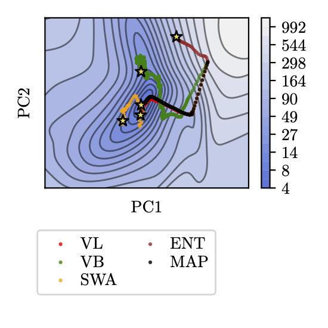

# Biasing Laplace approximations towards Variational Inference
This repository contains the code as well as the final paper for my research project in the group of [Philipp Hennig](https://uni-tuebingen.de/fakultaeten/mathematisch-naturwissenschaftliche-fakultaet/fachbereiche/informatik/lehrstuehle/methoden-des-maschinellen-lernens/start/).
## Summary

Recent work has shown that Laplace approximations and Variational Inference (VI) for Bayesian Neural Networks are approximately equal at convergence. The differences between MAP and VI training are however less well understood. We theoretically investigate this difference and propose that the benefit of VI on MAP is the convergence towards flat minima. Based on this, we investigate different flat minima algorithms for MAP and how they influence the Laplace approximation.

More information can be found in the full paper [here](ResearchProject_Philipp_VonBachmann.pdf).

Example result how different algorithms change the convergence behaviour in the loss landscape:
<p style="text-align:center;">

<p>


### Running the code

All experiments are in the folder **./experiments**. To display available parameters, just call
```bash 
python myscript.py --help
```
